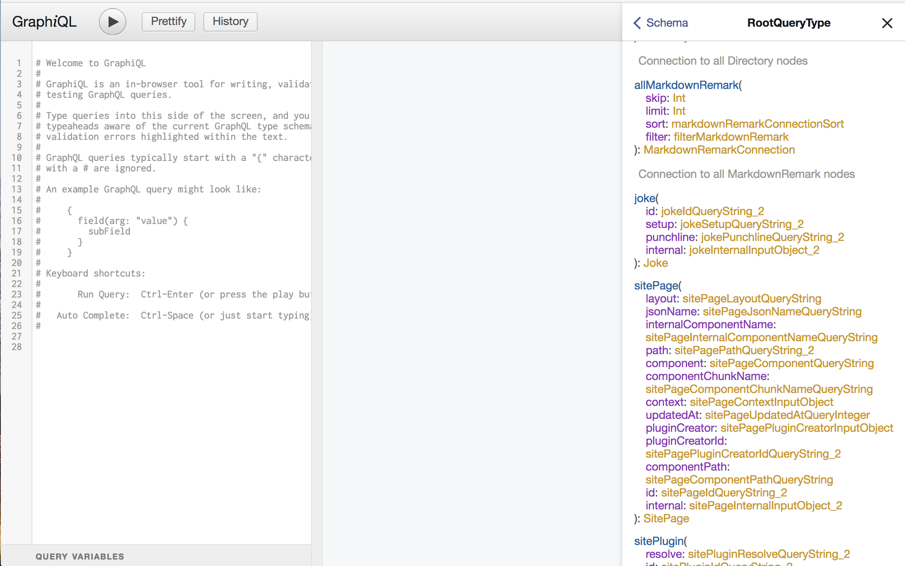
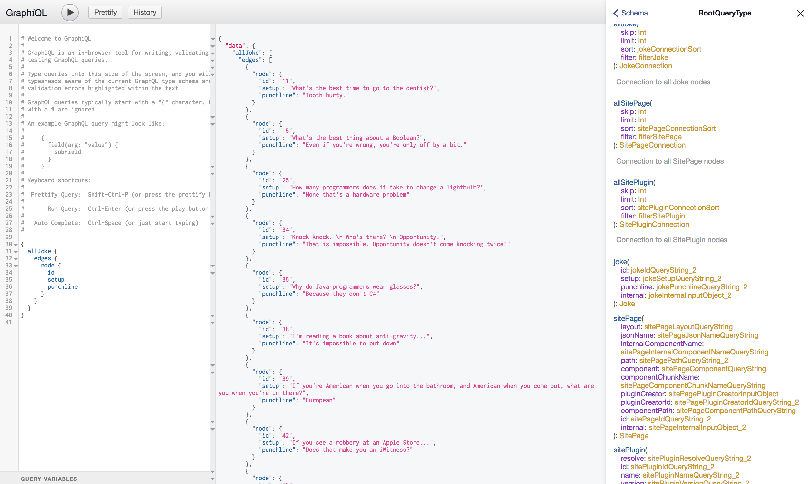

Gatsby works great with [Contentful](https://www.gatsbyjs.org/packages/gatsby-source-contentful/), [Headless Wordpress](https://www.gatsbyjs.org/blog/2018-01-22-getting-started-gatsby-and-wordpress/), and other CMS providers.

> But what if I have my own data source? How do I use that?

That is the problem that I had, and I'm going to show you how to solve it.

Hint: It's really easy 🙌.

We're going to start off by writing a Gatsby Plugin that fetches data from an API. For this example we are going to be fetching a random list of [jokes](https://github.com/15Dkatz/official_joke_api) and creating `GraphQL` nodes for them. Then verify them with `GraphiQL`, write a query, and render them in a React component in our Gatsby site.

### Create the plugin

Let's start off by creating a `plugins` directory in the root of the project (if it does not already exist). Inside of the plugins directory we'll create another directory that matches the name of our plugin. We'll call it `random-jokes`.

We're going to create 2 files inside of the `random-jokes` plugin directory: `package.json` and `gatsby-node.js`.

The purpose of the `package.json` file is to tell Gatsby the name of the plugin. We'll be adding this to the `gatsby-config.js` file shortly.

```js
// package.json

{"name": "random-jokes"}
```

Inside of the `gatsby-node.js` file we will be making use of Gatsby's [sourceNodes](https://www.gatsbyjs.org/docs/node-apis/#sourceNodes) API, as well as the `axios` data fetching library.

Now is a good time to add `axios` to your project if you are not already using it.

```js
yarn add axios

// or

npm install --save axios
```

In the `gatsby-node.js` file we are going to do 2 things:

1. Send an AJAX request to the external API.
2. Create a `GraphQL` node for each joke.

```js
// plugins/random-jokes/gatsby-node.js

const axios = require('axios');
const crypto = require('crypto');

const API_URI =
  'https://08ad1pao69.execute-api.us-east-1.amazonaws.com/dev/random_ten';

exports.sourceNodes = async ({boundActionCreators}) => {
  const {createNode} = boundActionCreators;
  const result = await axios.get(API_URI);
  for (const joke of result.data) {
    await createNode({
      children: [],
      id: joke.id.toString(),
      setup: joke.setup,
      punchline: joke.punchline,
      parent: null,
      internal: {
        type: 'Joke',
        contentDigest: crypto
          .createHash(`md5`)
          .update(JSON.stringify(joke))
          .digest(`hex`),
      },
    });
  }
};
```

### Tell Gatsby to use the plugin

We need let Gatsby know that we would like to use this plugin. To do so, we need to modify the `gatsby-config` file like so:

```js
// gatsby-config.js

module.exports = {
  ...

  plugins: [
    'random-jokes',
  ]
  ...
}
```

### Find the newly created node in GraphiQL

Restart Gatsby and it will create our new `Joke` nodes. Before trying to write a query inside of a component, it is always a good idea to first explore your data with the GraphiQL interface. It should be running on [http://localhost:8000/\_\_\_graphql](http://localhost:8000/___graphql)

In the upper right hand side of the GraphiQL interface click `< Docs` and scroll down until you see the `joke` node as pictured below.



Let's write a query in the left hand pane to view our results.

```js
{
  allJoke {
    edges {
      node {
        id
        setup
        punchline
      }
    }
  }
}
```

Press the "play" button in the upper left hand corner and you should see the results of the query populate in the middle pane.



### Create a new page in Gatsby

Now that we have verified that all of the data is showing up as expected we can create a page and add our query to our page component. Lets create the file `/src/pages/jokes.js`.

```js
// src/pages/jokes.js

import React from 'react';

export default class Jokes extends React.Component {
  _renderJokes = () => {
    const jokes = this.props.data.allJoke.edges;
    return jokes.map(joke => {
      return (
        <li key={joke.node.id}>
          <p>{joke.node.setup}</p>
          <p>{joke.node.punchline}</p>
        </li>
      );
    });
  };

  render() {
    return <ul className="Jokes">{this._renderJokes()}</ul>;
  }
}

export const query = graphql`
  query JokesQuery {
    allJoke {
      edges {
        node {
          id
          setup
          punchline
        }
      }
    }
  }
`;
```

And that's all there is to it.

This post is an example of how you can use your external APIs as Gatsby data sources. Coming soon is another post on how to retrieve external images during build time so that you may use them with `gatsby-image`.
