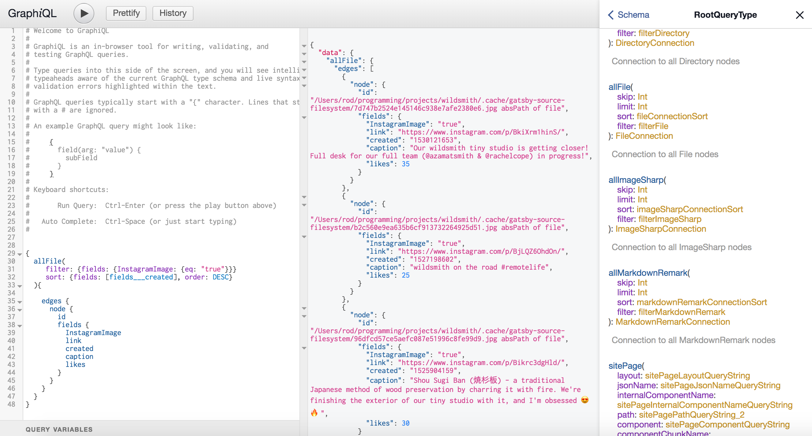
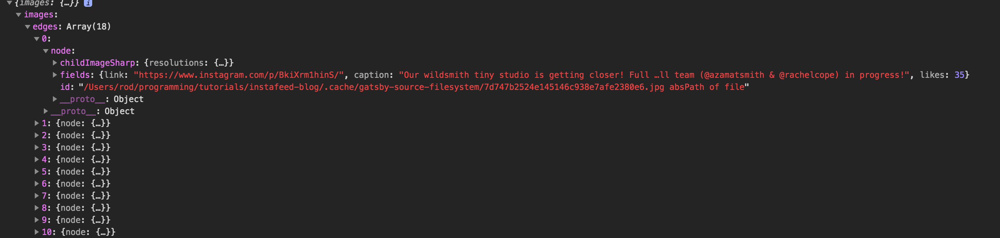

Want to add your Instagram feed to your site? Lazy load remote images with gatsby-image? Write your first Gatsby plugin? Then you're in the right place.

In this post we're going to go through the steps to add images to your Gatsby site from your Instagram feed at build time by creating a plugin.

## Dependencies

First we're going to need a few packages. You may already be using some of them so feel free to skip the ones you already have:

- `gatsby-source-filesystem`
- `axios`
- `gatsby-image`
- `gatsby-transformer-sharp`
- `gatsby-plugin-sharp`

```
npm install --save gatsby-source-filesystem axios gatsby-image gatsby-transformer-sharp gatsby-plugin-sharp

or

yarn add gatsby-source-filesystem axios gatsby-image gatsby-transformer-sharp gatsby-plugin-sharp
```

## First things first

You'll need an Instagram token to fetch your images from the Instagram API. Don't have one? There are a number of token generators, I used [this one](https://elfsight.com/blog/2016/05/how-to-get-instagram-access-token/).

## Create the Plugin

Got your token? Great, lets create a `plugins` directory if one does not already exist in the root of your project.

Inside of that directory create a folder called `my-instagram-feed` which contains two files: `package.json` and `gatsby-node.js`.

```
node_modules
plugins
  |- my-instagram-feed
    |- package.json
    |- gatsby-node.js
public
src
static
gatsby-node.js
package.json
...
```

The purpose of the `package.json` file is to tell Gatsby the name of our plugin. We'll be adding this to the `gatsby-config.js` file shortly.

```js
// my-instagram-feed/package.json

{"name": "my-instagram-feed"}
```

Inside of the `gatsby-node.js` file we will be making use of Gatsby's [sourceNodes](https://www.gatsbyjs.org/docs/node-apis/#sourceNodes) API, the `axios` data fetching library. We'll also be using the `gatsby-source-filesystem` package to download images during build time.

For this plugin we need to

- Fetch our Instagram feed
- Create a remote file node
- Add additional fields to the node (caption, likes, link).

Here is what the code looks like

```javascript
// my-instagram-feed/gatsby-node.js

const {createRemoteFileNode} = require(`gatsby-source-filesystem`);
const axios = require('axios');

// Replace ACCESS_TOKEN with your Instagram token
const API_URI =
  'https://api.instagram.com/v1/users/self/media/recent/?access_token=ACCESS_TOKEN';

exports.sourceNodes = async ({boundActionCreators, store, cache}) => {
  const {createNode, createNodeField} = boundActionCreators;
  // Fetch data
  const {data} = await axios.get(API_URI);

  // use for loop for async/await support
  for (const image of data.data) {
    let fileNode;
    try {
      fileNode = await createRemoteFileNode({
        // Add split so createRemoteFileNode creates the correct extension
        // (Instagram sometimes adds additional url params causing this bug)
        url: image.images.standard_resolution.url.split('?')[0],
        cache,
        store,
        createNode,
      });
      // TODO: add additional fields
    } catch (error) {
      console.warn('error creating node', error);
    }
  }
};
```

The code above will pull in your Instagram feed and create file nodes for each of the images it downloads 👊.

But there is a small problem...

We want to query _only_ the Instagram images. If we were to write the GraphQL query as is, we would get back every image that is part of our project. Let's fix this by creating a field to identify Instagram images and add additional image properties like `catption`, `link`, and `likes`.

```javascript
// my-instagram-feed/gatsby-node.js
  ...
      // TODO: add additional fields
      // Add a property to make querying easier
      await createNodeField({
        node: fileNode,
        name: 'InstagramImage',
        value: 'true',
      });
      await createNodeField({
        node: fileNode,
        name: 'link',
        value: image.link,
      });
      await createNodeField({
        node: fileNode,
        name: 'created',
        value: image.created_time,
      });
      await createNodeField({
        node: fileNode,
        name: 'caption',
        value: image.caption.text,
      });
      await createNodeField({
        node: fileNode,
        name: 'likes',
        value: image.likes.count,
      });

    } catch (error) {
    ...
```

Feel free to add additional properties from your images. Maybe you want to show comments?

The final step of creating a plugin is to add the plugin name to your `gatsby-config.js` file.

```js
// gatsby-config.js

module.exports = {
  ...

  plugins: [
    'my-instagram-plugin',
    'gatsby-plugin-sharp',
    'gatsby-transformer-sharp',
  ]
  ...
}
```

> Why this works: Gatsby first looks for a local directory called `plugins` to resolve any self-created plugins.

## Check the data with GraphiQL


Restart Gatsby and it will create and download all of your Instagram images. The main purpose of doing all of this work is to have `gatsby-plugin-sharp` create `childImageSharp` nodes so that we can make use of [gatsby-image](https://github.com/gatsbyjs/gatsby/tree/master/packages/gatsby-image)

Open up the GraphiQL interface. It should be running on [http://localhost:8000/\_\_\_graphql](http://localhost:8000/___graphql)

Let's write a query in the left hand pane to find our Instagram images.

```javascript
{
  allFile(
    filter: {fields: {InstagramImage: {eq: "true"}}}
    sort: {fields: [fields___created], order: DESC}
  ){
    edges {
      node {
        id
        fields {
          InstagramImage
          link
          created
          caption
          likes
        }
      }
    }
  }
}
```

Press the "Play" button in the upper left hand corner. You should see results like so:



Results... did you get them? Nice 🤘, now let's put them to use.

## Displaying the Feed

Create a new page in `/src/pages` and name it `instafeed.js`.

We'll start by creating an empty shell and adding our query that we came up with in GraphiQL.

```javascript
// instafeed.js

import React from 'react';
import GatsbyImage from 'gatsby-image';

export default class InstaFeed extends React.Component {
  render() {
    console.log('data', this.props.data);
    return (
      <div className="Instafeed">{/* <!-- images will go here --> */}</div>
    );
  }
}

export const query = graphql`
  query MyInstaFeed {
    images: allFile(
      filter: {fields: {InstagramImage: {eq: "true"}}}
      sort: {fields: [fields___created], order: DESC}
    ) {
      edges {
        node {
          childImageSharp {
            resolutions(width: 250) {
              ...GatsbyImageSharpResolutions
            }
          }
          id
          fields {
            link
            caption
            likes
          }
        }
      }
    }
  }
`;
```

Gatsby passes results from a query into a component as a prop called `data`. I find it helpful to
log the data so I can figure out how I will generate the display method.



We want to make use of the `childImageSharp` property and are going to be using the `resolutions` type of image for this example. [This](https://www.gatsbyjs.org/packages/gatsby-image/#two-types-of-responsive-images) section of the `gatsby-image` docs is a great resource to find out which type of image to use.

Now we just have to add function to our component and make use of `gatsby-image`.

```javascript
// instafeed.js

  ...
  _renderImages = () => {
    const {images} = this.props.data;
    return images.edges.map(image => (
      <div style={{margin: 16}} key={image.node.id}>
        <GatsbyImage resolutions={image.node.childImageSharp.resolutions} />
      </div>
    ));
  };

  render() {
    return (
      <div
        className="InstaFeed"
        style={{
          alignItems: 'center',
          display: 'flex',
          flexWrap: 'wrap',
          justifyContent: 'center',
          marginBottom: 40,
          marginTop: 40,
        }}
      >
        {this._renderImages()}
      </div>
    );
  }
}
...
```

This will work as an example of how to show your Instagram feed on a single Gatsby page. But it isn't a scalable solution. What if you wanted an `<Instafeed />` component that you could use on multiple pages in your site? In the current version of Gatsby you would have to add the query to each page and pass the `data` as a prop to you component. There is a shortcut using GraphQL query fragments and I will show you how to do that in a future post.

I've prepared an example repo [here](https://github.com/wildsmithstudio/gatsby-instagram-blog-example/blob/master/README.md).
